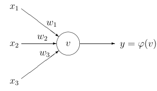
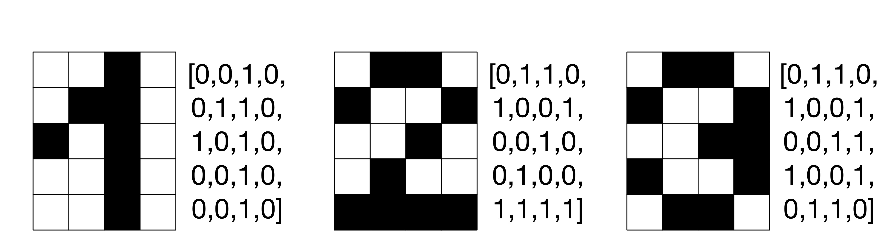
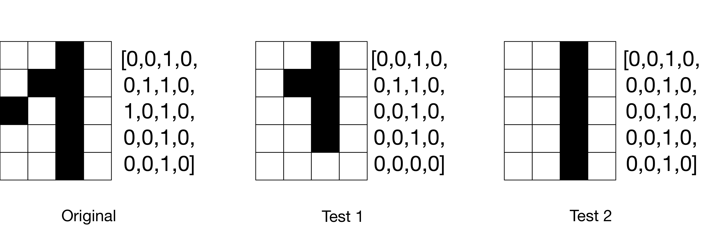

_Exercise assignment for the course [Introduction to AI (partII)](https://inf-git.fh-rosenheim.de/aai-ai2/hsro-aai-ai2-github-io) in the [Bachelor of AAI](https://www.th-rosenheim.de/en/technology/computer-science-mathematics/applied-artificial-intelligence-bachelors-degree) at [Rosenheim University of Applied Sciences](http://www.th-rosenheim.de)_

# 05 - Neural Networks

For this exercise you can find some hints within the provided Jupyter Notebooks.

**Solution is provided within the branch "musterloesung".**

## Exercise 1: Playground Exercises

Follow the playground exercises on https://developers.google.com/machine-learning/crash-course/introduction-to-neural-networks/playground-exercises

This exercise will help you to understand Neural Networks with some visualization.

## Exercise 2 - Neural Network

Calcluate and implement for the following NN the output!

Below is a diagram with a single artificial neuron (unit):

The node has three inputs x = (x1, x2, x3) that receive only binary signals (either 0 or 1). Suppose that the weights correspond
ing to the three inputs have the following values w1 =2, w2 =-1, and w3=1 and the activation of the unit is given by the step-function (which is 1 if wx>0 and 0 otherwise).

Calculate what will be the output value y of the unit for each of the following input patterns P(x1,x2,x3):

- P1 [1,0,0]
- P2 [0,1,1]
- P3 [1,0,1]
- P4 [1,1,1]

### a) Make the math on paper!

### b) Validate your answers with Python!

## Exercise 3 - Naive Classifier with Backpropagation

In this task, an attempt is made to create a 3-layer NN (Input- 1 Hidden Layer - Output) and train it usnig backpropagation. The data set for this is the digits (1-3) in a grid (4x5) as an example of handwritten numbers.

Import the ([Naive-MNIST-ANN](Naive-MNIST-ANN.ipynb)) into your Jupyter Notebook environment and try to solve the task. The task is to describe a simple neural network including hidden layers and to implement the backprogation algorithm.

>The places you have to touch are marked with `?todo`!

Your tests could look like this:

