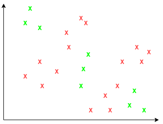

_Exercise assignment for the course [Introduction to AI (partII)](https://inf-git.fh-rosenheim.de/aai-ai2/hsro-aai-ai2-github-io) in the [Bachelor of AAI](https://www.th-rosenheim.de/en/technology/computer-science-mathematics/applied-artificial-intelligence-bachelors-degree) at [Rosenheim University of Applied Sciences](http://www.th-rosenheim.de)_


# 07 - Activation, Learning Rate and Model Topology

For this exercise you can find some hints within the provided Jupyter Notebooks.

**Solution is provided within the branch "musterloesung".**

## Exercise 1: Activation Functions

#### a) Pros and cons of activation functions

Please explain pros and cons of the following activation functions:

- sigmoid
- tanh
- ReLU

#### b) Derivatives

What is the derivative of `tanh`?

## Exercise 2:  Python coding

### a) Plot the sigmoid and tanh with matplotlib in one graph!

Plot the graph in the range from -10 to 10. Please specify both activation functions in its own function.

### b) Plot the ReLU, leakyRelu with a=0.01 and ReLu6 in one graph using matplotlib!

Plot the graph in the range from -10 to 10. Please specify both activation functions in its own function.

## Exercise 3: Model Topology

#### a)

Given the following code. Please sketch the ANN including input and output layer. Note on each layer which activation function is used.

```python
model = Sequential()
model.add(Dense(4, activation='tanh', input_shape=(3,)))
model.add(Dense(6, activation='tanh'))
model.add(Dense(4, activation='relu'))
model.add(Dense(2, activation='softmax'))
```

#### b)

Given the following classification problem. Please try to motivate and sketch the classification boundaries. 



How does the ANN can looklike?

Write some pseudo Python code describing the model topology and pick appropriate activation functions?
