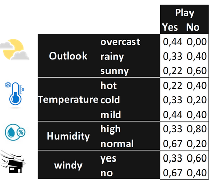

_Exercise assignment for the course [Introduction to AI (partII)](https://inf-git.fh-rosenheim.de/aai-ai2/hsro-aai-ai2-github-io) in the [Bachelor of AAI](https://www.th-rosenheim.de/en/technology/computer-science-mathematics/applied-artificial-intelligence-bachelors-degree) at [Rosenheim University of Applied Sciences](http://www.th-rosenheim.de)_

# Mock exam

Here are some test exercises for exam preparation!

---

## Task 1: Basics and Bayes (7 + 4 = 11P)

### a) Some Questions
- Name 3 activation functions which are used for Neural Networks!

- Name 2 algorithms which are used in Decision Trees to identify nodes!

- What is the derivative of **tanh**?

### b) Bayes

Do I play golf given the following table?

Explain using Naive Bayes!



---

## Task 2: Metrics (7P)

Given are 12 pictures of bananas and apples. Your classifier should recognize bananas
(Positives).
Please specify true positvies (TP), true negatives (TN), false positives (FP) and false negatives (FN):

- 5 are not banana recognizes, of which 3 are banana though.
- 5 are not recognized as bananas, but 3 of them are bananas
- 7 are recognized as bananas, 5 of them are really bananas
- 7 are recognized as bananas, but 2 of them are apples

Calculate the following metrics for the given distribution::

- Precision
- Recall
- Accuracy
- F1-Score
- MCC

---

## Task 3: Perceptron (2 + 6 = 8P)

### a)

Create a 2-layer perceptron that solves the XOR operation for 2 input values (x1 and x2)?


### b)

Calculate based on the **perceptron learning rule**.

Given the sets 

```
M+=[[-2, 1],[1, 0]] and 

M-=[[-1,-1],[-3,1]]
```

1. Show graphically that these are _linearly separable_.


2. Apply the **Perceptron learning rule** to these quantities and give a possible sequence of values for the weight vector. Start with the weight vector w=(1,1).

---

## Task 4: Neural Networks (4 + 6 = 10P)

### a)

Calcluate the output for the following NN (single neuron)!

The node has four inputs x = (x1, x2, x3, x4) that receive only binary signals (either 0 or 1).

Suppose that the weights corresponding to the three inputs have the following values w1 =4, w2 =-2, w3=1 and w4=-1 and the activation of the unit is given by the ReLU-function.

Calculate what will be the output value y of the unit for each of the following input patterns P(x1,x2,x3,x4):

- P1 [1,0,0,1]
- P2 [0,1,0,1]
- P3 [0,0,1,1]
- P4 [1,1,1,1]

### b)

Lets say you have created a neural network for multi-class classification. 

The classes are _apple_, _banana_, _pear_, _orange_ (in this order!).

Your neural network emits as a feed forward result the following logist O=[0.2, 1.3, 0.2, 0.8] for the input banana.

1. Calculate the output probabilites with softmax.

2. What is the desired output for input banana using hot encoding? Define the expected output vector using hot encoding!

3. What is the loss if you use cross-entropy (LCE)? Compare the output if a with b!

4. What is the LCE given the ouput after softmax is O2=[0.13, 0.82, 0.03, 0.02] for the input banana? Is it better or not?

---

## Task 5: Convolutional Networks  (6 + 4 = 10P)

### a) 

What does the following Python programm output?

```python
import numpy as np

M = np.array([[3, 5, 4, -2],
              [1, 3, -1, 2],
              [-3, 2, 2, -1],
              [5, -4, 1, 1]])

C = np.array([[-1,  1,  1],
              [ 0,  1,  2],
              [ 1, -1, -1]])

# kernel size
k = C.shape[0]
# target size
t = M.shape[0] - k + 1
# init result
conv = np.zeros(shape=(t, t))

for i in range(t):
    for j in range(t):
        T = M[i:i + k, j:j + k]
        conv[i, j] = np.sum(np.multiply(T, C))

print(conv)
```

### b)

Consider a convolutional neural network that is used to classify images into two classes.

The structure of the network is as follows:

```
INPUT: 28x28 grayscale images.

LAYER 1: Convolutional layer with 25 3x3 convolutional filters.

LAYER 2: A max pooling layer with pool size (2,2) and step size 2

LAYER 3: Convolutional layer with 25 5x5 convolutional filters.

LAYER 4: A max pooling layer with pool size (2,2) and step size 2

LAYER 5: Dense layer with ??? units

LAYER 6: Single output unit
```

1. Specifiy the dimensions on each layer!
2. What is the size of layer 5?

---

## Task 6: Natural Language Processing (2 + 4 + 4 = 10P)

Given are the three sentences D1, D2 and D3:

- D1: "Dog eat dog. Eat cat too!" 

- D2: "Eat home, it's raining cats and dogs." 

- D3: "Dog or cat, I do not care."

### a)

What does the vocabulary look like when "too", "it's", "do", "not" are stopwords?

### b)

How does the TF-IDF look like for the three sentences?

### c)

Which sentences are more similar based on cosine similarity?
